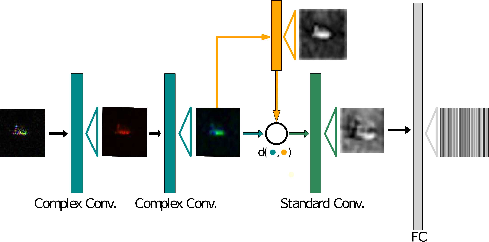
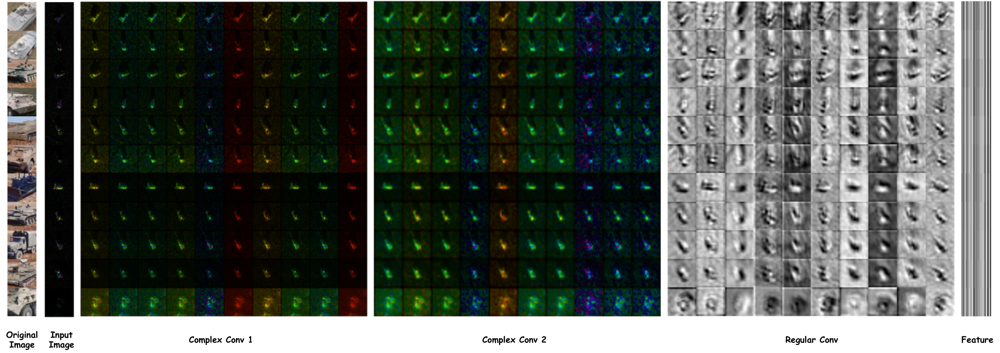

# Complex-Valued Deep Neural Network with Weighted Fréchet Mean

- There is an updated version of the code at [This Link](https://github.com/sutkarsh/cds). This code is adapted from code made by [Rudrasis Chakraborty](https://github.com/rudra1988), and is an outdated version for [This Paper](https://arxiv.org/abs/1906.10048). 

## Abstract

Complex-valued deep learning has attracted increasing attention in recent years, due to its versatility and ability to capture more information. However, the lack of well-defined complex-valued operations remains a bottleneck for further advancement. In this work, we propose a geometric way to define deep neural networks on the space of complex numbers by utilizing weighted Fréchet mean. We mathematically prove the viability of our algorithm. We also define basic building blocks such as convolution, non-linearity, and residual connections tailored for the space of complex numbers. To demonstrate the effectiveness of our proposed model, we compare our complex-valued network comprehensively with its real state-of-the-art counterpart on the MSTAR classification task and achieve better performance, while utilizing less than 1% of the parameters. 




## People
- [Rudrasis Chakraborty](https://github.com/rudra1988)
- [Yifei Xing](mailto:xingyifei2016@berkeley.edu) 
- [Peter Wang](mailto:peterwg@berkeley.edu)
- [Stella Yu](mailto:stellayu@berkeley.edu)




## Requirements
* [PyTorch](https://pytorch.org/)

## Data Preparation

- First, run `cat data_split* > data_polar.zip` inside the `data` folder.

- Next, extract `data_polar.zip` and set the correct path to the data_polar folder inside the argparse configuration in `train_demo.py`


## Getting Started (Training & Testing)


- To train the model: 
```
python train_demo.py
```

## Baseline
[Here](https://github.com/xingyifei2016/MSTAR_baseline) is code for a baseline ResNet50 model that we used in the paper. Our model utilizes approximately 1% of model parameters of this baseline model and achieves slightly better results.

## Newer Work
[Here](https://github.com/xingyifei2016/shrinkage_demo) is our more recent work that utilizes a prototype-based shrinkage estimator for complex-valued deep learning.


## CAUTION
The current code was prepared using single GPU. The use of multi-GPU may cause problems. 

## DISCLAIMER
The wFM layer (SurReal) were proposed and written by Rudrasis Chakraborty.

## License and Citation
The use of this software is RESTRICTED to **non-commercial research and educational purposes**.
